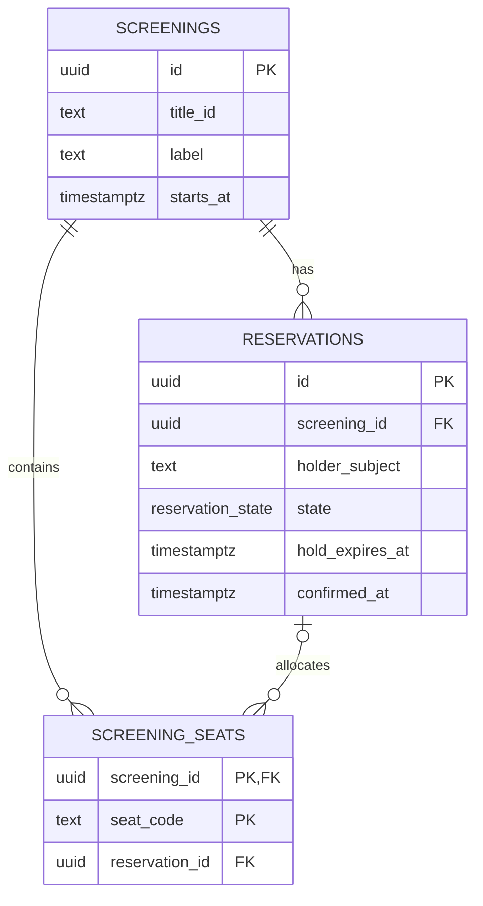

# Kino ticket service

This is Kino's Fastify-first ticket-allocation service. It owns a fixed
PostgreSQL sample schedule: three showtimes for `tt0000001` and two each for
`tt0000002` and `tt0000003`. It accepts user JWTs only from Kino's Next.js BFF.
It is intentionally private: browsers call `/api/tickets/*` on the BFF, not
this service. Kubernetes also permits ingress only from the UI/BFF pod; JWT
validation remains the application-layer boundary.

## PostgreSQL allocation persistence model

This logical entity-relationship diagram (ERD) shows the records and fields
needed to understand seat allocation. It is not the complete physical schema.
The Flyway [migrations](../../../orchestrators/k8s/terraform/ticket-db-migrations/)
are the authoritative definition of every PostgreSQL column, constraint, seed,
index, and runtime grant.

`timestamptz` is PostgreSQL shorthand for `timestamp with time zone`; it records
an absolute moment, which keeps screening, hold-expiry, and confirmation times
unambiguous across time zones.

### ERD field guide

| Table | Field | Answers |
| --- | --- | --- |
| `screenings` | `id` | “Which showing is this?” Kino seeds a small immutable schedule. |
| `screenings` | `title_id` | “Which catalog title is shown?” This is an IMDb/Mongo catalogue reference, not a cross-database foreign key. |
| `reservations` | `id` | “Which hold or ticket lifecycle is this?” |
| `reservations` | `screening_id` | “Which showing does this reservation belong to?” |
| `reservations` | `holder_subject` | “Which authenticated Kino user owns it?” This is the opaque OIDC `sub`, not a Mongo `_id` or username. |
| `reservations` | `state`, `hold_expires_at`, `confirmed_at` | “Is this a live hold or a confirmed ticket, and when did that state become invalid or final?” `state` is PostgreSQL's `reservation_state` enum: the intentionally stable `HELD` and `CONFIRMED` values. Database constraints require a confirmation time only for confirmed reservations. |
| `screening_seats` | `(screening_id, seat_code)` | “Which physical seat in which showing?” The composite primary key permits each seat to appear once per screening. |
| `screening_seats` | `reservation_id` | “Which reservation currently owns this seat?” It is `NULL` when no reservation is attached. Its composite foreign key prevents linking a seat to a reservation from another screening. |

### Allocation lifecycle

Read the model in this order:

1. `screenings` identifies the showing and its source-catalogue title.
2. `screening_seats` is the authoritative seat map. There is deliberately no
   stored “available” flag: availability is derived from its reservation and
   the database clock.
3. A hold creates one `reservations` row in `HELD` state and attaches its seat
   rows to that reservation. Confirmation changes that same row to `CONFIRMED`.

The allocation transaction locks requested seat rows in a stable code order.
An unexpired hold or confirmed reservation makes its seats unavailable. An
expired hold is reclaimed lazily by a later hold: the historical reservation
remains, while the seat points at the new reservation. Confirmed seats remain
attached and sold. The service intentionally has no payment records, schedule
management, cancellation flow, or background expiry worker.

### Ownership and safe inspection

The root PostgreSQL bootstrap creates separate migrator and runtime roles.
Flyway owns DDL and seed data; `kino_ticket_runtime` receives only the
column-level `SELECT`, `INSERT`, and `UPDATE` privileges needed by this service.
It cannot alter schema, read Flyway history, or update immutable seat identity.

`holder_subject` is an opaque user identifier and should be treated as personal
data. Inspect identifiers, state, expiry, and confirmation timestamps when
debugging; do not manually change reservations or seat links in a live
allocation database.

## Runtime contract

- `TICKET_DATABASE_URL` connects as `kino_ticket_runtime`.
- `AUTH_SERVER_ISSUER_URI` is validated exactly.
- `AUTH_SERVER_JWK_SET_URI` is the explicit local/dev in-cluster JWK trust
  endpoint. It is not OIDC Discovery and must never be taken from a token.
- Access tokens are marked `typ: at+jwt` by auth-service and the ticket
  service rejects other JWT types before using their claims.
- `TICKET_HOLD_DURATION_SECONDS` defaults to `120`.
- `TICKET_DB_LOCK_TIMEOUT_MS` and `TICKET_DB_STATEMENT_TIMEOUT_MS` default to
  `1000` and `3000` respectively.
- `TICKET_JWK_TIMEOUT_MS` defaults to `500`. Its value, the `1000` ms default
  `TICKET_DB_CONNECTION_TIMEOUT_MS`, and the statement timeout must leave a
  500 ms margin inside
  `TICKET_BFF_UPSTREAM_TIMEOUT_MS` (which defaults to the BFF's five-second
  upstream deadline). Transactional allocation also uses PostgreSQL 17's
  `transaction_timeout` to bound the total transaction, not just each
  individual SQL statement. PostgreSQL applies the configured statement timeout
  to both transactional allocation and read-only queries.
- Fastify's application-level handler timeout and Node's request/header receive
  timeouts use the BFF deadline. Write routes commit through their transaction
  boundary; PostgreSQL's timeouts retain the bound for a statement already in
  flight when a client disconnects.

The allocation operation locks seat rows in immutable code order and uses
PostgreSQL `clock_timestamp()` for expiry decisions. Expired holds are reclaimed
lazily; confirmed seats remain sold. The service deliberately retains expired
reservation history and has no expiry worker; introduce retention/cleanup only
when Kino grows beyond this fixed, short-lived sample schedule. Direct hold requests
are independently capped at 1 KiB and return `413` when too large.

On `SIGTERM` or `SIGINT`, the service stops accepting requests, closes Fastify,
then closes PostgreSQL connections. Kubernetes grants it ten seconds to finish;
a shutdown failure is logged and exits nonzero. The image and Pod run as the
unprivileged `node` user with no Linux capabilities.

## Sources

- [Fastify validation and serialization](https://fastify.dev/docs/latest/Reference/Validation-and-Serialization/)
- [Fastify body limits](https://fastify.dev/docs/latest/Reference/Server/#bodylimit)
- [Fastify server timeouts](https://fastify.dev/docs/latest/Reference/Server/)
- [node-postgres transactions](https://node-postgres.com/features/transactions)
- [node-postgres pool configuration](https://node-postgres.com/apis/pool)
- [PostgreSQL explicit locking](https://www.postgresql.org/docs/current/explicit-locking.html)
- [PostgreSQL enumerated types](https://www.postgresql.org/docs/current/datatype-enum.html)
- [PostgreSQL client connection defaults](https://www.postgresql.org/docs/current/runtime-config-client.html)
- [PostgreSQL date/time functions](https://www.postgresql.org/docs/current/functions-datetime.html)
- [RFC 6750 bearer errors](https://www.rfc-editor.org/rfc/rfc6750.html)
- [RFC 9068 JWT access-token profile](https://www.rfc-editor.org/rfc/rfc9068.html)
