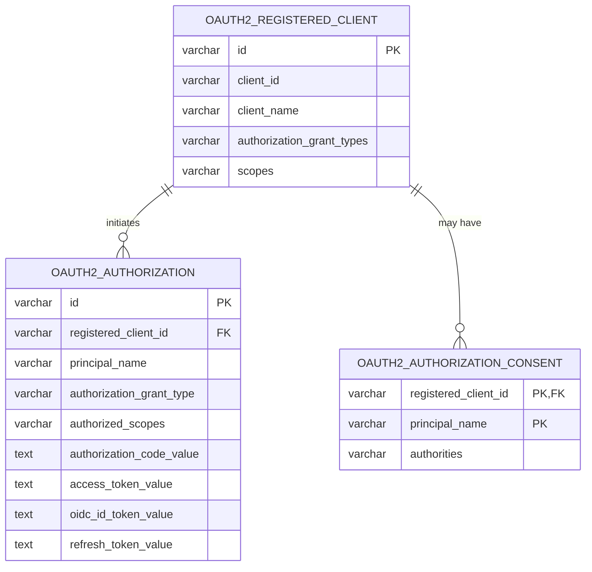

# Kino Auth Service

Kino's Spring Boot Auth Service is the system's Authorization Server. It keeps
application users in MongoDB, keeps OAuth/OIDC protocol state in PostgreSQL,
and uses Redis for short-lived browser login sessions.

## Active responsibilities

- authenticates users through Spring Security's CSRF-protected form login
- issues OIDC Authorization Code with PKCE tokens to the confidential Next.js
  BFF client
- rotates BFF refresh tokens
- supports RP-initiated OIDC logout for the BFF's registered post-logout
  callback
- issues client-credentials JWTs to the agent service
- publishes OIDC discovery, JWKS, token, revocation, and user-info endpoints

The service does not expose legacy `secured`/`non-secured` demonstration
endpoints. User-facing catalog access is enforced by `data_service`; browser
tokens are held only by the UI's BFF session store.

## State boundaries

| State | Store | Owner |
| --- | --- | --- |
| User profile and password verifier | MongoDB | Auth Service |
| OIDC clients, codes, consents, and refresh tokens | PostgreSQL `kino_auth` | Spring Authorization Server |
| Browser login session | Redis | Spring Session |

`CustomUser.oidcSubject` is a stable opaque identity claim. Mongo creates its
unique sparse index from the persistence model at startup; a legacy-user
backfill is no longer part of the runtime path.

## OAuth/OIDC PostgreSQL persistence model

This is a logical entity-relationship diagram (ERD): it shows the protocol
records and the fields needed to understand their relationships. It is not the
complete physical schema. The Flyway [schema migration](../../../orchestrators/k8s/terraform/auth-db-migrations/V1__spring_authorization_server.sql)
is the authoritative definition of every PostgreSQL column.



### ERD field guide

| Table | Field | Answers |
| --- | --- | --- |
| `oauth2_registered_client` | `id` | “Which internal client registration is this?” Other protocol tables reference this value. |
| `oauth2_registered_client` | `client_id` | “Which public OAuth identity does this application present?” |
| `oauth2_registered_client` | `client_name` | “What should an operator call this client?” |
| `oauth2_registered_client` | `authorization_grant_types` | “Which OAuth flows may this client use?” |
| `oauth2_registered_client` | `scopes` | “Which permissions may this client request?” |
| `oauth2_authorization` | `id` | “Which authorization lifecycle is this?” |
| `oauth2_authorization` | `registered_client_id` | “Which client initiated this lifecycle?” |
| `oauth2_authorization` | `principal_name` | “Which Kino username authenticated?” The user record remains in MongoDB. |
| `oauth2_authorization` | `authorization_grant_type` | “Which OAuth flow created this lifecycle?” |
| `oauth2_authorization` | `authorized_scopes` | “Which permissions were actually issued?” |
| `oauth2_authorization` | `authorization_code_value` | “Which short-lived, one-time code may the BFF exchange?” Sensitive credential. |
| `oauth2_authorization` | `access_token_value` | “May this client call this API, with which scopes, and on whose behalf?” Sensitive credential. |
| `oauth2_authorization` | `oidc_id_token_value` | “Which user just authenticated to this client?” Sensitive credential. |
| `oauth2_authorization` | `refresh_token_value` | “Which server-side credential may obtain replacement access tokens?” Sensitive credential. |
| `oauth2_authorization_consent` | `registered_client_id` | “Which client received this user's approval?” Together with `principal_name`, it is the primary key. |
| `oauth2_authorization_consent` | `principal_name` | “Which user granted this approval?” |
| `oauth2_authorization_consent` | `authorities` | “Which scopes or authorities did the user approve?” |

### Reading order and omitted fields

Read the model in this order:

1. `oauth2_registered_client` answers, “Which application is allowed to ask?”
2. `oauth2_authorization` answers, “What happened during this login and token
   lifecycle?”
3. `oauth2_authorization_consent` answers, “Which scopes did this user approve
   for this application?”

The logical ERD omits the following supporting fields to remain readable:

| Field group | Purpose |
| --- | --- |
| `client_secret`, `client_secret_expires_at` | Confidential-client credential hash and its optional expiry. The original secret is never stored. |
| `client_settings`, `token_settings` | Spring-managed JSON controlling PKCE, consent, token format, lifetime, and refresh-token reuse. |
| `state` | Opaque value that correlates the authorization response to the request that started the login and protects that boundary against CSRF. |
| `attributes`, `*_metadata` | Spring-managed serialized context, token claims, and invalidation state. Do not edit these fields manually. |
| `*_issued_at`, `*_expires_at` | Issue and expiry times for each protocol credential. |
| `user_code_*`, `device_code_*` | Device Authorization Grant state. A `user_code` is shown to a person; a `device_code` stays with the device. Kino does not enable this grant, so these fields are normally `NULL`. |

### Authorization lifecycle

`oauth2_registered_client` registers trusted applications. Kino bootstraps the
confidential Next.js BFF and the `agent-service` machine client. The BFF uses
`authorization_code` and `refresh_token`; the agent uses `client_credentials`.

Each BFF login creates or updates one `oauth2_authorization` row. Its
`state`, `attributes`, and authorization-code fields hold the short-lived login
transaction. After code redemption, the same row holds token values, issue and
expiry times, scopes, and Spring metadata. A refresh replaces the current
access and refresh token values; Kino disables refresh-token reuse, so the
previous refresh token is no longer accepted.

The access token answers, “May this client call this API, with which scopes,
and when delegated, on whose behalf?” The OIDC ID token answers, “Which user
just authenticated to this client?”

When a user signs out, the BFF first deletes its server-held session and
revokes its refresh token. It then redirects the browser through the OIDC
end-session endpoint using that ID token and the BFF's registered post-logout
callback. This ends both the BFF session and the authorization-server browser
session, so a subsequent protected page requires a new login.

Kino does not require an authorization-consent screen, so
`oauth2_authorization_consent` is normally empty.

### Safe inspection

The protocol tables contain sensitive credential material. `client_secret` is
a one-way hash, but authorization codes and token-value columns are still
credentials. Do not copy, log, export, or display their values in screenshots.
Inspect identifiers, grant types, scopes, issue times, expiry times, and
metadata structure instead. `attributes`, `*_metadata`, `client_settings`, and
`token_settings` are Spring-managed serialized data and should not be edited
manually.

## Run and verify

From this directory:

```bash
./gradlew test
```

The canonical Kubernetes deployment and credential configuration live in
[`orchestrators/k8s/terraform`](../../../orchestrators/k8s/terraform/README.md).
For the cross-service design, see the repository
[`ARCHITECTURE.md`](../../../ARCHITECTURE.md).
