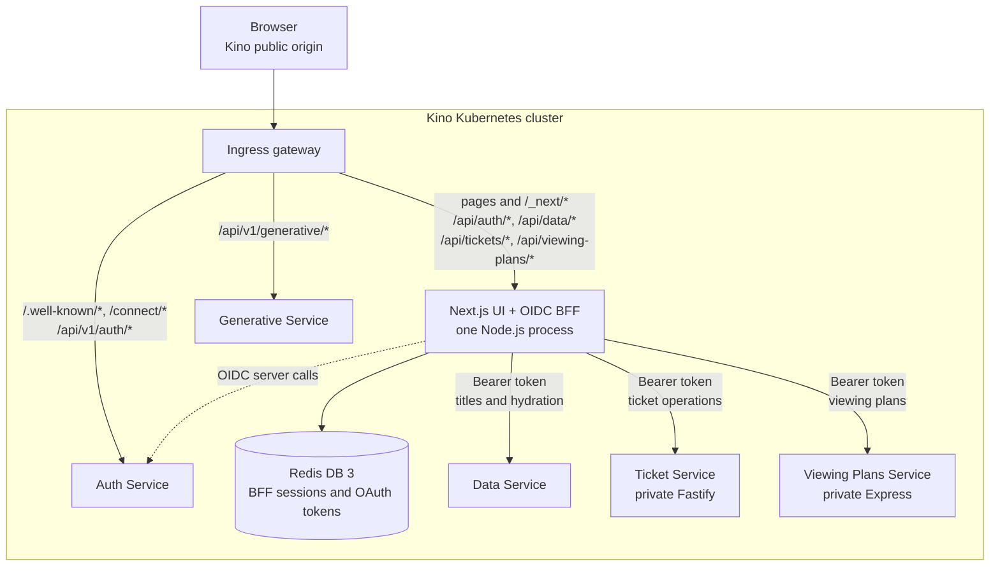

# Kino UI and OIDC BFF

This directory contains Kino's browser UI and its backend-for-frontend (BFF).
It uses Next.js 14, primarily with the App Router, plus React 18, Material UI
5, and Redux Toolkit. The interactive `/login` screen used by the Auth Service
flow is the one remaining Pages Router route.

The UI and BFF are two responsibilities inside one application, not two
deployments. A production image contains one standalone Next.js server running
in one Node.js process. That process serves pages and browser assets and also
executes the server-only Route Handlers under `src/app/api/`. Redis, the
authorization server, and the downstream application services remain separate
network services.

For the wider system context, see the [architecture guide](../../../ARCHITECTURE.md).

## Runtime model

`next build` produces both the server runtime and browser bundles. The
[production Dockerfile](Dockerfile) copies Next.js's standalone output and
`.next/static` into a Node.js 22 Alpine image, then starts the generated
`server.js` on port 3000.

React components marked with `"use client"`, Redux Toolkit, and the Material UI
code they import are compiled into browser JavaScript chunks. Through the Kino
Ingress, the browser downloads those chunks from the same Kino origin under
paths such as `/_next/static/*`; it does not download Material UI from a CDN.
Server Components and the modules under `src/server/bff/` execute only in
Node.js and are not exposed as browser code.

The public request boundary looks like this:



Not every browser request goes through BFF logic. Page requests, navigation,
images, and compiled JavaScript/CSS use normal Next.js handling. Protected
catalog, ticket, and viewing-plan calls use same-origin BFF endpoints. OIDC
protocol navigation and the current title-facts request use direct Ingress
routes.

## Browser and BFF request flow

| Browser request | Handled by | Purpose |
| --- | --- | --- |
| `/`, `/titles/*`, `/starred`, `/tickets/*`, `/viewing-plans`, `/_next/*` | Next.js | Pages, navigation, and built browser assets |
| `/api/auth/*` | Next.js Route Handlers | Start and finish BFF login/logout transactions |
| `/api/data/titles*` | Next.js BFF -> Data Service | Protected title reads |
| `/api/tickets/*` | Next.js BFF; most routes -> private Fastify service | Local feature status, screenings, seat holds, reservations, and saved seat groups |
| `/api/viewing-plans/*` | Next.js BFF; most routes -> private Express service | Local feature status and user-owned viewing plans; list responses are hydrated with titles from Data Service |
| `/.well-known/*`, `/connect/*`, `/api/v1/auth/*` | Ingress -> Auth Service | OIDC discovery, end-session, authorization, token, login, and CSRF endpoints |
| `/api/v1/generative/*` | Ingress -> Generative Service | Current browser-side title-facts request |
| `/api/health/live`, `/api/health/ready` | Next.js | Kubernetes process and dependency probes |

The protected Data, Ticket, and Viewing Plans BFF routes receive the browser's
opaque cookie, load the server-side session, refresh tokens when necessary,
and attach the resulting access token to their downstream request. Except for
their local status endpoints, Ticket and Viewing Plans routes are feature-gated
and return a controlled `404` when disabled. Their services are private in the
Kubernetes network; the browser does not call them directly. Those services
still validate the bearer token against the Auth Service's JWK set and enforce
their own scopes: the BFF is not a replacement for downstream authorization.

The title-facts request is currently the exception: client code constructs a
public Generative Service URL from `NEXT_PUBLIC_API_HOST_URL`. The catalog UI
itself uses `/api/data/*` and does not send browser credentials to the public
`/api/v1/data` Ingress route.

## OIDC session lifecycle

Kino uses the Authorization Code flow with PKCE through a confidential
Next.js BFF client:

1. Browser code sends a same-origin `POST /api/auth/login`. The BFF creates a
   short-lived, one-time login transaction in Redis and returns the Auth
   Service authorization URL.
2. The browser navigates to the authorization endpoint through Ingress and
   authenticates with the Auth Service. Next.js renders the login page, but its
   form posts directly to the Auth Service; the password is never submitted to
   the Next.js BFF.
3. The Auth Service redirects the browser to `/api/auth/callback`. The BFF
   verifies the cookie-bound state, nonce, and PKCE verifier, exchanges the
   authorization code, and stores the access, refresh, and ID tokens in Redis
   DB 3.
4. The browser receives only `kino_bff_session`, a host-only, HttpOnly,
   `SameSite=Lax` cookie containing an opaque session identifier. JavaScript
   cannot read it, and no OAuth token is stored in browser state or storage.
5. A protected BFF request resolves that identifier in Redis. The BFF forwards
   the server-held access token and refreshes it under a Redis lock when it is
   close to expiry.
6. `POST /api/auth/logout` removes the local Redis session, attempts refresh
   token revocation, and sends the browser through the Auth Service's
   `/connect/logout` endpoint. The callback consumes a one-time logout
   transaction so both the BFF and authorization-server browser sessions end.

Redis state is intentionally ephemeral in local/dev deployments. A Redis
restart invalidates BFF sessions and users authenticate again. Terraform gives
the BFF a dedicated `kino-bff` Redis ACL restricted to `kino:bff:*` keys; DB 3
is the logical database selected for these records.

## Source map

- `src/app/` - App Router layouts, pages, feature UI, Redux slices, and Route
  Handlers.
- `src/pages/login/` - the small Pages Router login screen rendered when the
  Auth Service starts an interactive browser login; its form posts directly
  back to the Auth Service.
- `src/app/api/` - the public Next.js server boundary for auth, Data, Ticket,
  Viewing Plans, and health endpoints.
- `src/server/bff/` - server-only OIDC, Redis session, refresh, proxy, timeout,
  and upstream-response logic.
- `src/components/` - shared React and Material UI components.
- `src/store/` - Redux Toolkit store and client provider.
- `src/http/api.js` - the browser-visible API base used by the current direct
  Generative Service request.
- `tests/unit/` - focused BFF and UI-domain helper tests using Node's test
  runner.
- `tests/e2e/` - deployed-environment OIDC BFF browser smoke using Playwright.

Keep secrets and token handling in `src/server/bff/`. A module imported by a
Client Component can be included in the browser bundle, and any variable whose
name begins with `NEXT_PUBLIC_` is browser-visible.

## Configuration

Terraform supplies the deployed runtime configuration. The following are the
variables the BFF code actually reads; defaults shown here are application
defaults, while Terraform sets explicit values for the deployed environment.

### Origins and OIDC client

| Variable | Application default | Role |
| --- | --- | --- |
| `BFF_PUBLIC_ORIGIN` | `http://local.kino.com` | Browser-visible canonical origin; also controls the cookie's `Secure` flag |
| `OIDC_ISSUER` | `http://local.kino.com` | Public issuer URL used for OIDC validation and browser-facing URLs |
| `OIDC_INTERNAL_ORIGIN` | `OIDC_ISSUER` origin | Cluster-internal Auth Service origin used for server-to-server OIDC calls |
| `WEB_BFF_CLIENT_ID` | `kino-web-bff` | Confidential OIDC client identifier |
| `WEB_BFF_CLIENT_SECRET` | required | Confidential client secret; server-only |
| `WEB_BFF_REDIRECT_URI` | `<BFF_PUBLIC_ORIGIN>/api/auth/callback` | Registered login callback |
| `WEB_BFF_POST_LOGOUT_REDIRECT_URI` | `<BFF_PUBLIC_ORIGIN>/api/auth/logout/callback` | Registered RP-initiated logout callback |
| `WEB_BFF_SCOPES` | `openid profile kino.data.read` | Space-separated scopes requested by the BFF |

### Downstream services

| Variable | Application default | Role |
| --- | --- | --- |
| `DATA_SERVICE_INTERNAL_URL` | `http://data-service:8082/api/v1/data` | Data Service base URL |
| `TICKET_SERVICE_ENABLED` | `false` | Enables Ticket BFF routes only when exactly `true` |
| `TICKET_SERVICE_INTERNAL_URL` | `http://ticket-service:8085` | Private Ticket Service base URL |
| `TICKET_SERVICE_TIMEOUT_MS` | `5000` | Ticket upstream timeout |
| `VIEWING_PLAN_SERVICE_ENABLED` | `false` | Enables Viewing Plans BFF routes only when exactly `true` |
| `VIEWING_PLAN_SERVICE_INTERNAL_URL` | `http://viewing-plan-service:8085` | Private Viewing Plans base URL |
| `VIEWING_PLAN_SERVICE_TIMEOUT_MS` | `5000` | Shared deadline for Viewing Plans and Data hydration calls |

### Redis sessions

| Variable | Application default | Role |
| --- | --- | --- |
| `BFF_REDIS_HOST` | `redis-stack.redis-stack-system` | Redis host |
| `BFF_REDIS_PORT` | `6379` | Redis port |
| `BFF_REDIS_USERNAME` | `default` | Redis username; Terraform injects the restricted `kino-bff` account |
| `BFF_REDIS_PASSWORD` | required | Redis password; server-only |
| `BFF_REDIS_DATABASE` | `3` | BFF session database |
| `BFF_SESSION_IDLE_SECONDS` | `1800` | Sliding session idle TTL |
| `BFF_SESSION_ABSOLUTE_SECONDS` | `28800` | Maximum session lifetime |

`NEXT_PUBLIC_API_HOST_URL` is the only browser-exposed application variable.
It is read by the current Generative Service call and is compiled into the
client bundle at build time. The production Dockerfile currently builds it as
`http://local.kino.com/api/v1`; the development Dockerfile uses
`http://dev.kino.com/api/v1`. Never place a secret in this or another
`NEXT_PUBLIC_*` variable.

For deployment inputs, use `TF_VAR_web_bff_client_secret` and optionally
`TF_VAR_web_bff_redis_password`; Terraform creates the Kubernetes Secrets and
injects the corresponding runtime variables. Do not commit `.env`, `*.tfvars`,
or generated Terraform state.

## Local development

Use Node.js 22, matching CI and the production container:

```bash
cd uis/react-ui/kino-ui
npm ci
npm run dev
```

Open <http://localhost:3000>. This is enough for ordinary component and layout
work. Authenticated BFF flows additionally require a reachable Auth Service,
Data Service, and Redis plus an OIDC client whose registered callback matches
the chosen public origin. Ticket and Viewing Plans work only when their
services and scopes are enabled. For end-to-end work, the Terraform-managed
environment is the supported and less error-prone setup.

Useful commands:

| Command | Purpose |
| --- | --- |
| `npm run dev` | Start the Next.js development server |
| `npm run lint` | Run the Next.js ESLint configuration |
| `npm run test:unit` | Run focused unit tests |
| `npm run build` | Create the optimized standalone production build |
| `npm run start` | Serve a completed build with Next.js outside the container |

The production container starts the standalone `server.js` directly rather
than using `npm run start`.

## OIDC BFF browser smoke

The Playwright smoke requires an already deployed test environment and
disposable user credentials. It covers login, a protected BFF title request,
optional token refresh, and RP-initiated logout. It verifies that the opaque
cookie is unavailable to browser JavaScript and that logout ends both browser
sessions.

Install Chromium once, then run:

```bash
npx playwright install --with-deps chromium

KINO_E2E_BASE_URL=http://local.kino.com \
KINO_E2E_USERNAME=... \
KINO_E2E_PASSWORD=... \
npm run test:e2e:oidc
```

Set `KINO_E2E_REFRESH_WAIT_SECONDS` only for an environment configured with a
short BFF access-token lifetime. The manual
[kino OIDC BFF E2E workflow](../../../.github/workflows/kino-oidc-bff-e2e.yaml)
runs the same test. Configure its `kino-e2e` environment with a non-sensitive
`KINO_E2E_USERNAME` variable and a `KINO_E2E_PASSWORD` secret.

## Ticket BFF load test

The bounded end-to-end load test lives in the Terraform workspace. It performs
one real PKCE browser login, writes only the opaque BFF session identifier to a
mode-`0600` temporary file, and sends traffic to the public same-origin Ticket
BFF routes. It does not expose OAuth tokens or call Fastify, Redis, or
PostgreSQL directly.

Deploy a fresh ticket-enabled stack with seat `A1` available, then run from the
repository root:

```bash
cd orchestrators/k8s/terraform

KINO_E2E_BASE_URL=http://local.kino.com \
KINO_E2E_USERNAME=... \
KINO_E2E_PASSWORD=... \
task load-test-ticket
```

See the [Terraform load-test documentation](../../../orchestrators/k8s/terraform/README.md#local-capacity-contract)
for the workload, resource guardrails, and expected contention result.

## Build, release, and deployment

The [UI CI workflow](../../../.github/workflows/kino-ui.yaml) runs lint and unit
tests, validates the production image, and publishes eligible releases. A
published run reports a digest-pinned image reference and uploads a release
manifest. Tags help operators discover an image; the digest is the deployment
contract.

Normal deployment is Terraform-based:

1. Copy the published digest into `TF_VAR_ui_image_ref` in the Terraform
   workspace's gitignored `.env`.
2. Configure the other required service images and secrets.
3. Run `task deploy` from `orchestrators/k8s/terraform`.

Follow the complete [Terraform deployment guide](../../../orchestrators/k8s/terraform/README.md).
Raw manifests and `kubectl rollout restart` are not release mechanisms for the
UI.
